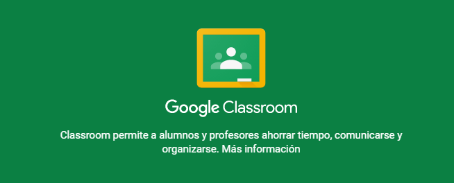

## 1.2\. ¿Qué ofrece Google Classroom? {#1-2-qu-ofrece-google-classroom}

Google Classroom es una especie de aula virtual + red social que permite alojar y compartir contenido, asignar tareas, evaluarlas o comunicarse con los alumnos. Es ideal como herramienta de _blended learning_ ([aprendizaje semipresencial](https://es.wikipedia.org/wiki/Aprendizaje_semipresencial)) o para aplicar técnicas de _Flipped Classrooom_ _(_[_aula invertida_](https://es.wikipedia.org/wiki/Aula_invertida)_)_, puesto que permite alojar todo tipo de información documental y multimedia para seguir la asignatura pero además da acceso de forma muy intuitiva y controlada al trabajo colaborativo en Google Drive. Por otro lado, permite crear redes de profesorado que facilitan el seguimiento de las clases, compartir materiales, establecer convocatorias, etc. El ahorro en papel es considerable, así como las ventajas organizativas y el control sobre la participación de los alumnos, tanto por parte de los profesores como de sus familias.

A lo largo de este curso iremos analizando y poniendo en práctica todas estas posibilidades.

Fig. 2\. Google Classroom. [https://classroom.google.com/](https://classroom.google.com/)