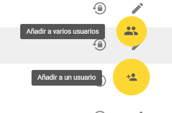
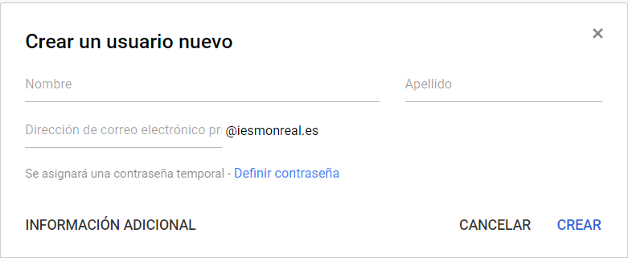

## 1.5\. Tareas de Administración {#1-5-tareas-de-administraci-n}

Además de registrar el dominio y solicitar el servicio, el Administrador es el encargado de una tarea fundamental: crear y administrar usuarios.

Solo él o los docentes Administradores (existe un Superadministrador que puede crear usuarios Administradores) tienen acceso a la Consola de Administración.

Fig. 4\. Acceso al panel de Administración desde el inicio de sesión

Fig. 5\. Escritorio de Administración

El icono de _Usuarios_ nos permite acceder a la pantalla de creación y gestión de los mismos. Se pueden crear usuarios de uno en uno o también utilizar una hoja *.csv para crearlos de forma masiva. En la parte inferior derecha de la pantalla aparecen los iconos que lo gestionan:

Fig 6\. Creación de usuarios

Para crear un único usuario basta con rellenar la ficha correspondiente en la que hay que asignar un correo electrónico del dominio y una contraseña. Es importante en este caso seguir siempre un mismo criterio para asignar estos nombres: número de expediente, inicial y apellidos del alumno, etc. La contraseña puede ser la misma para todos los usuarios nuevos ya que en el momento en que acceden por primera vez se les solicita el cambio. Así mismo, si un usuario pierde o no recuerda la contraseña el administrador puede resetear la cuenta volviendo a crear una nueva contraseña que podrá ser cambiada de nuevo por el usuario.

Fig 7\. Pantalla de creación de un nuevo usuario

Para añadir un número alto de usuarios es necesario crear previamente una hoja de cálculo en formato *.csv con todos ellos, en la que se incluyan todos los datos que se solicitan: nombre, usuario, contraseña y otros según las indicaciones que se muestran en las ayudas.

Fig 8\. Pantalla para inscripción masiva de usuarios

La siguiente tarea esencial es la de creación de grupos, pues facilita enormemente el trabajo posterior. Se trata de establecer a qué grupo o grupos pertenece cada alumno: por ejemplo, un alumno de 1º de PAI puede incluirse en el grupo 1pai@nombrecentro y también en 1a@nombrecentro y en delegados@nombrecentro. Al tener grupos creados, si un profesor quiere comunicarse por correo electrónico con todos los alumnos de su clase o matricularlos en Classroom, no tiene que escribir sus direcciones de una en una; con que escriba el nombre del grupo es suficiente.

Google afirma que “prácticamente puedes tener todos los usuarios que quieras” y que, en ese sentido, no es necesario inhabilitar a los usuarios inactivos. No obstante, por cuestiones de seguridad, conviene, pasado un tiempo, cerrar las cuentas de antiguos alumnos o compañeros.

Además de la gestión de usuarios, el administrador puede modificar permisos de acceso a los elementos de Classroom.

[incrustar aquí la presentación Mod1_1.5]