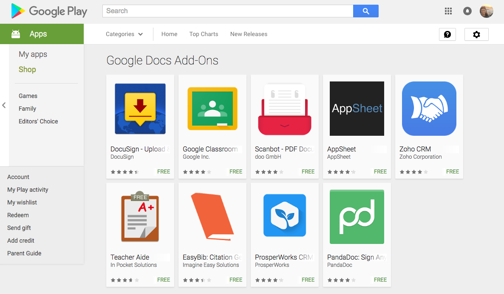

## 1.7\. Instalación de la App {#1-7-instalaci-n-de-la-app}

Dependiendo de los dispositivos con los que trabajemos en el centro o en casa, puede resultar interesante descargarnos la aplicación en nuestra tableta o teléfono móvil.

Fig 9\. Instalación de la app en dispositivos Android

Esto permite una acceso a todos los contenidos desde cualquier dispositivo, facilitando la tarea al profesor y manteniendo accesible los contenidos a los alumnos. También posibilita subir con mayor celeridad fotos o vídeos tomados directamente con el dispositivo móvil.