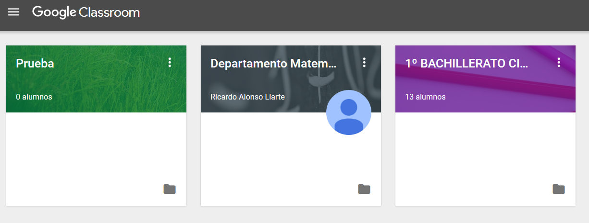
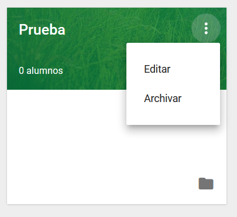
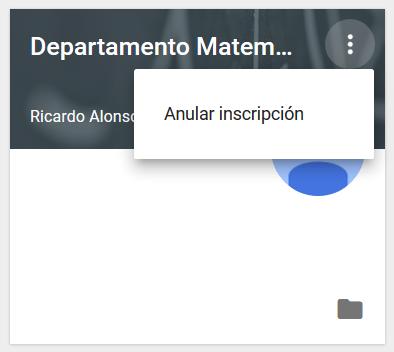
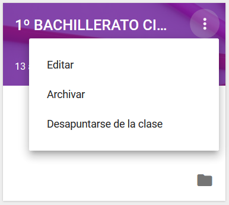

## Entrando en Classroom

Al entrar en Classroom veremos todas las clases que tenemos creadas o aquellas en las que participamos...

El icono que representa la carpeta da acceso directo a la carpeta que se ha creado en Drive.

El icono de tres puntos que se encuentra en la esquina superior derecha de cada clase permite unas tareas de gestión u otras en función de qué perfil se tiene en cada clase:

En el caso de ser el creador y administrador de la clase...  

En el caso de estar como alumno en una clase...

En el caso de estar invitado como profesor en una clase de otro compañero...

Los permisos como alumno están más limitados que como profesor dentro de la clase. A continuación se describe cómo es una clase de la que se es profesor.

Se pueden disponer las clases en el orden que se quiera de una manera sencilla, desplazándolas en la ventana.

