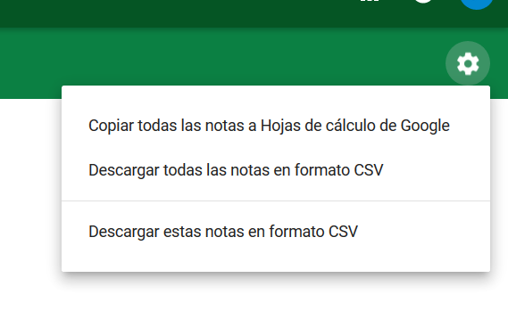
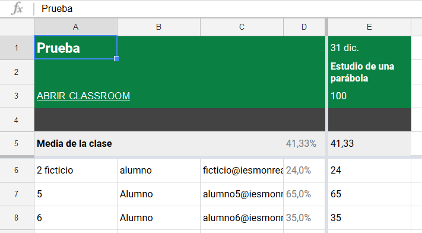
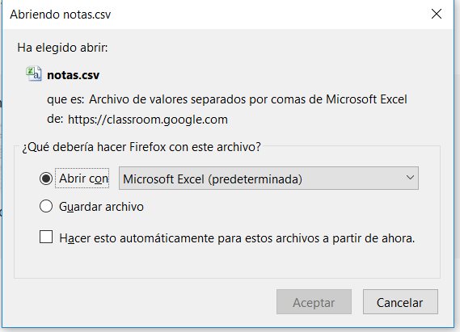

## 3.4\. Descargar las notas {#3-4-descargar-las-notas}

Desde el botón de configuración se llega a un menú que permite descargar las notas de las tareas a una hoja de cálculo.

La primera opción recoge las notas de TODAS las tareas que haya en esa clase y las almacena en una hoja de cálculo de Google con la que se podrá trabajar con otras hojas ya existentes. El archivo que se genera se almacena en la carpeta Classroom del Drive.

La segunda opción hace lo mismo que la primera pero en formato *.csv, separados por comas. La tercera, también descarga en este mismo formato pero solo las notas de la tarea en la que se esté, no de todas. En estos dos casos se abre una ventana que permite guardar los archivos en el ordenador.

