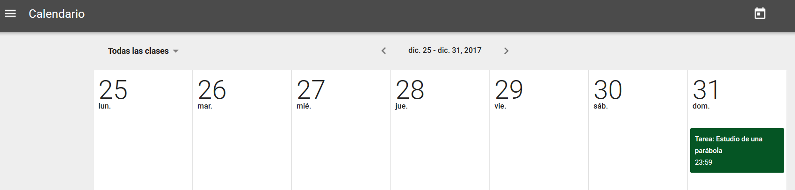

## 3.5\. Tareas en el calendario {#3-5-tareas-en-el-calendario}

Cuando se propone una tarea a los alumnos, con fecha, automáticamente la tarea aparece en el calendario, tanto en el de Classroom como en el de Google Calendar. En el primero no se puede realizar ninguna modificación mientras que en el segundo sí que se puede editar y añadir o modificar.

No hay muchas posibilidades con el calendario de Classroom. Hay una especial dificultad para moverse por las fechas pues no permite otra disposición más que la semanal. Una visión del calendario mensual también vendría bien. Para poder avanzar en el tiempo hay que hacerlo con los símbolos &gt; y &lt; de semana en semana. El icono de la imagen de la parte superior derecha te lleva a la semana actual.

También se puede elegir la visualización de tareas de todas las clases o de alguna en concreto seleccionándola en el desplegable.