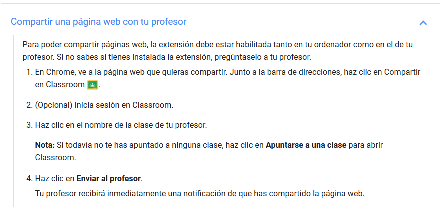

En los módulos anteriores hemos conocido las funcionalidades básicas de Google Classroom, más que suficientes para su utilización diaria en el aula. En este último módulo del curso vamos a presentar algunas opciones avanzadas que facilitan aspectos concretos del trabajo con Google Classroom o que pueden resultar interesantes a los usuarios de determinadas aplicaciones de la Web 2.0 que son compatibles.

## 4.1\. La extensión “Compartir con Classroom” {#4-1-la-extensi-n-compartir-con-classroom}

Los profesores y alumnos pueden compartir páginas web con la clase gracias a la extensión del navegador Chrome “Compartir con Classroom” o “Share to Classroom”. Obviamente, solo funciona con el navegador Google Chrome. En Firefox no hay un complemento parecido.

**¿Quién puede instalar la extensión?**

Los administradores de G Suite pueden preinstalar la extensión para todos los miembros del centro educativo. Si no es el caso, tanto profesores como alumnos pueden instalarla.

**Instalación por parte de los profesores:**

1.  Deben buscar la extensión en la tienda Chrome ([https://chrome.google.com/webstore](https://chrome.google.com/webstore)) o dirigirse directamente a [g.co/sharetoclassroom](https://g.co/sharetoclassroom).
2.  Clic en “Añadir a Chrome” y después en “Añadir extensión”.
3.  El icono aparecerá en la esquina superior derecha, junto a la barra de direcciones.
4.  Para compartir una página web con la clase solo hay que hacer clic sobre el icono, siempre y cuando antes hayamos iniciado sesión en nuestro navegador Chrome.

**Los profesores comparten con la clase:**

Se contemplan dos situaciones en las que nos puede resultar útil esta extensión:

*   Queremos que la página web que estamos viendo aparezca inmediatamente en los navegadores de todos los alumnos y profesores invitados (por ejemplo, si estamos en mitad de una clase en la que utilizamos los portátiles y queremos ahorrar tiempo y evitar que los alumnos tecleen la dirección).
*   Estamos creando una tarea, una pregunta o un anuncio y la web es un recurso de apoyo. En ese caso, se nos abrirá un menú para editar la tarea/ pregunta/ anuncio, como sucede cuando las creamos en el apartado “Novedades”.

**Los alumnos comparten con el profesor:**

Si un alumno de Classroom se añade esta extensión, podrá enviar la web al profesor, y este actuará como filtro antes de que se publique para toda la clase.

    <iframe src="https://docs.google.com/presentation/d/e/2PACX-1vTGukvA30dYeg1seYsXUd6Te2OenZKPofMbb-F1fzX-hqIDeTQQUjYcOAe3UFN1C64_KkJiLX9JpIIA/embed?start=false&loop=false&delayms=3000" frameborder="0" width=100% height="569" allowfullscreen="true" mozallowfullscreen="true" webkitallowfullscreen="true"></iframe>

