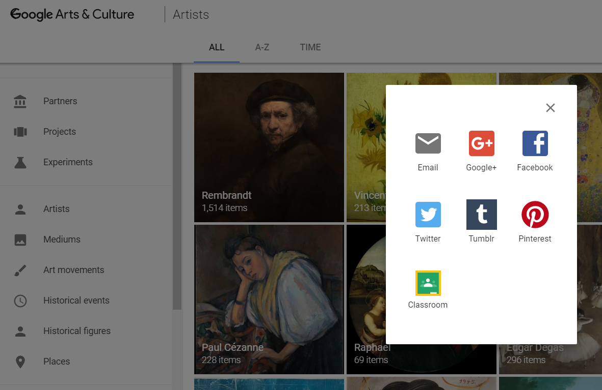
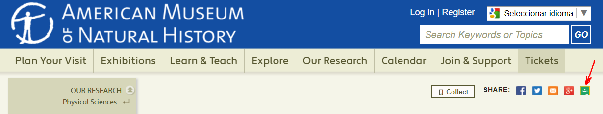
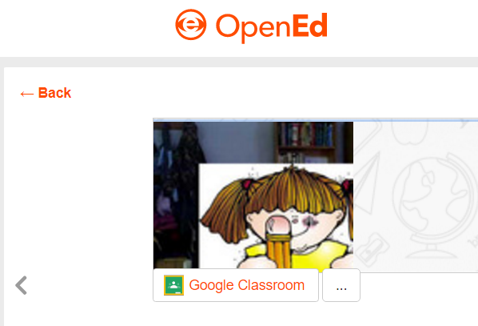

## 4.3. Páginas web que integran Classroom {#4-3-p-ginas-web-que-integran-classroom}

Algunas webs van integrando Google Classroom como un elemento más por medio del cual compartir los recursos que ofrece. Es verdad que muchas están en inglés, son de pago…, pero también se pueden encontrar algunas gratuitas.

De todas ellas hemos seleccionado alguna:

#### - Google Arts&Culture: {#google-arts-culture}

[https://www.google.com/culturalinstitute/beta/theme/9QJyZ-tyLu9GJQ](https://www.google.com/culturalinstitute/beta/theme/9QJyZ-tyLu9GJQ)

#### - Museo de Historia Natural de América: [http://www.amnh.org/](http://www.amnh.org/) {#museo-de-historia-natural-de-am-rica-http-www-amnh-org}

#### -OpenED: [https://www.opened.com/search](https://www.opened.com/search) {#opened-https-www-opened-com-search}

#### 

#### **-Scratch: **[**https://scratch.mit.edu/**](https://scratch.mit.edu/)

#### 

#### -**PhET, simulaciones interactivas para Ciencias y Matemáticas:** [https://phet.colorado.edu/es/](https://phet.colorado.edu/es/)

